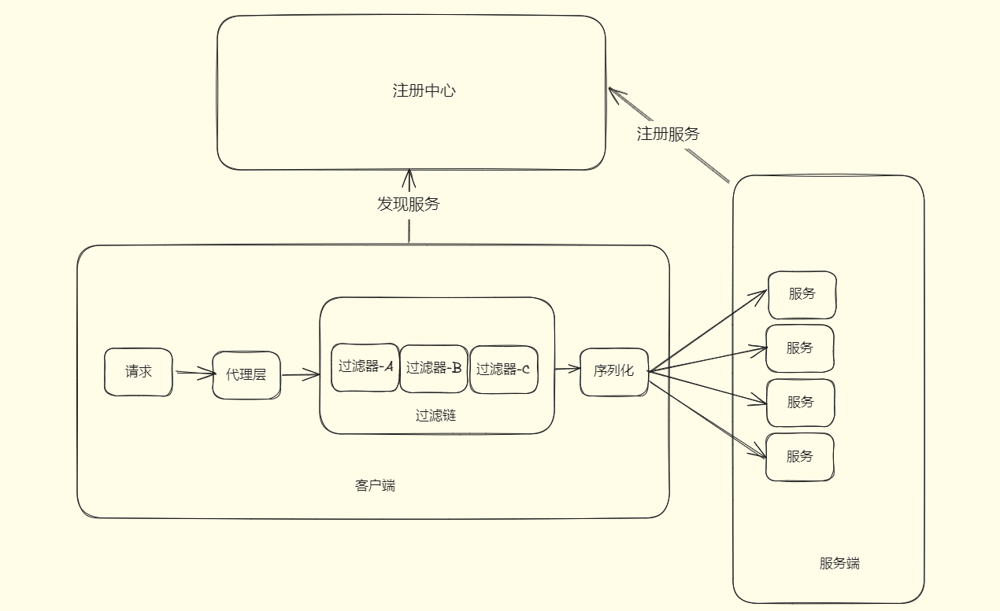
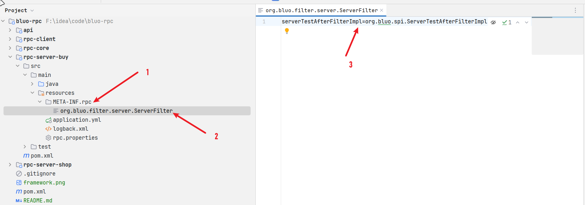

# BLUO-RPC


BLUO-RPC 是一款基于 Netty 实现的 RPC 框架。支持多种序列化方式、负载均衡算法、注册中心。并且通过SPI机制，可以很方便的扩展功能。

## 架构图


## 特性

- 实现了基于 Netty，让使用者仅一个注解即可完成服务的注册与调用
- 使用 Jackson 实现了协议数据的序列化和反序列化
- 实现了三种负载均衡算法：随机、轮询和 Hash一致性算法
- 使用 Nacos 和 Redis 作为注册中心，管理服务提供者信息
- 实现了 SPI 机制，可以很方便扩展功能


## 传输协议

```

+---------------+---------------+
| Magic Number | Data Length    |
| 2 bytes      | 4 bytes        |
+---------------+---------------+
| Data Bytes                    |
| Length: ${Data Length}        |
+-------------------------------+

```

| 字段            | 解释                              |
| :-------------- |:--------------------------------|
| Magic Number    | 魔数: 9527                   |
| Data Length     | 数据字节的长度                         |
| Data Bytes      | 传输的对象，是一个RpcInvocation, 长度由内容决定 |

## 快速使用

### 公共模块

#### 导入接口模块

```xml
<dependency>
    <groupId>org.bluo</groupId>
    <artifactId>api</artifactId>
    <version>1.0.1</version>
</dependency>

<dependency>
    <groupId>org.bluo</groupId>
    <artifactId>rpc-core</artifactId>
    <version>1.0.1</version>
</dependency>
```

#### 定义调用接口

```java
public interface MessageService {
    String getMessage(String message);
}

public interface OtherService {
    String getMessage(String message);
}

```

### 消费方

#### 添加服务

```java
@RestController
@RequestMapping("/client")
public class ClientController {
    @RpcReference(serviceName = "buy")
    private MessageService messageService;

    @RpcReference(serviceName = "shop")
    private OtherService otherService;

    @RequestMapping("/test")
    public String test() {
        return messageService.getMessage("111") + " @ " + otherService.getMessage("222");
    }
}
```

#### 开启服务

```java
@SpringBootApplication
@EnableRpcClient
public class ClientApp {
    public static void main(String[] args) throws InterruptedException {
        SpringApplication.run(ClientApp.class, args);
    }
}

```

### 提供方

#### 实现接口

```java
@RpcService
@Service
public class MessageServiceImpl implements MessageService {
    @Override
    public String getMessage(String message) {
        return "buy service";
    }
}

```

#### 开启服务

```java
@EnableRpcServer
@SpringBootApplication
public class BuyAppServer {
    public static void main(String[] args) {
        SpringApplication.run(BuyAppServer.class, args);
    }
}
```

## 配置文件

### 消费方

```shell
# 应用名称
rpc.applicationName=rpc-demo
# 序列化方式
rpc.serialize=jackson
# 注册中心地址
rpc.registerAddr=127.0.0.1:8848
# 注册中心类型
rpc.registerType=nacos
# 负载均衡类型
rpc.routerType=consistHash
# 失败重试次数
rpc.retryTime=3
# 重试间隔
rpc.retryInterval=1500
```

### 服务方

```shell
# 应用名称
rpc.applicationName=buy
# 序列化方式
rpc.serialize=jackson
# 注册中心地址
rpc.registerAddr=127.0.0.1:8848
# 注册中心类型
rpc.registerType=nacos
# 服务端口
rpc.port=45655
```

## SPI机制

> 1. 在resources目录下创建 META-INF/rpc 文件夹
> 2. 创建文件，名字为接口的全路径
> 3. 填写内容，名称=实现类路径

